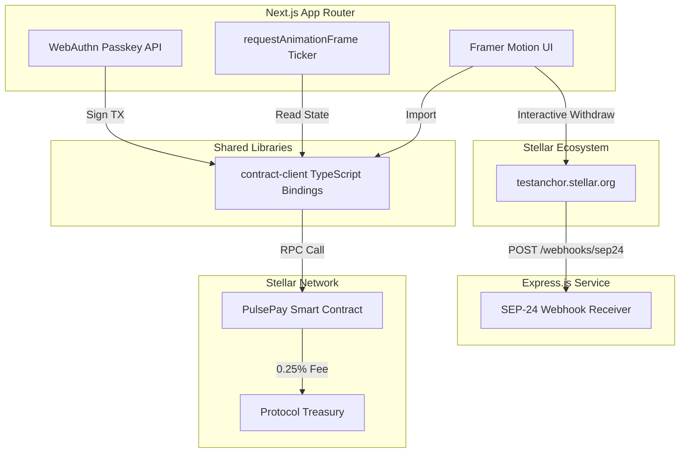

# PulsePay: Product Requirements Document (v1.0)

## 1. Executive Summary
PulsePay is a continuous streaming payment protocol built on Stellar's Soroban smart contract network. It allows employers to stream USDC directly into the wallets of workers on a per-second basis. Through high-performance React UI tickers and secure WebAuthn (Passkeys), PulsePay bridges the gap between Web3 settlement and Web2 UX.

## 2. Realized Architecture & Implementation
*Note: This section reflects the exact shipped architecture, which evolved from the initial spec to optimize for speed, security, and developer experience.*

### Monorepo Structure
We utilized a **Turborepo** + **pnpm** setup to manage the multi-language dependencies:
- `/contracts`: Soroban Rust smart contracts.
- `/packages/contract-client`: Auto-generated TypeScript bindings directly from the compiled `.wasm`.
- `/apps/frontend`: Next.js 15 (App Router) client with Tailwind CSS, shadcn/ui, and Framer Motion.
- `/apps/backend`: Express.js service for handling SEP-24 webhooks from Stellar Anchors.

### Core Smart Contract Logic
- **Streaming Math**: `Balance = (CurrentTime - StartTime) * Rate - Withdrawn`. All math uses native `i128` types to prevent overflow, scaled to Stellar's 7 decimals.
- **Cancellation Policy (Locked Decision)**: If an employer cancels a stream mid-flight, all accrued but unwithdrawn capital instantly becomes claimable by the worker. The employer only claws back the unstreamed/future portion.
- **Fee Model (Locked Decision)**: A 0.25% fee is deducted dynamically on each worker withdrawal, routed to an upgradable multisig protocol treasury address.
- **Security**: Complete adherence to the Checks-Effects-Interactions pattern, coupled with `Address::require_auth()`.

### Account Abstraction & UX
- **Passkeys (WebAuthn)**: The initial spec suggested using third-party wrappers, but we migrated to native `navigator.credentials.create()` (WebAuthn API) to reduce dependency risk while providing biometric security (Face ID/Touch ID) backed by hardware enclaves.
- **Real-Time Ticker**: Rather than polling the contract every second, the frontend fetches an absolute baseline timestamp and interpolates the rate using a `requestAnimationFrame` loop, resulting in a perfect 60fps display that never succumbs to floating-point drift.

## 3. Architecture Diagram

## 4. SEP-24 Anchor Integration
PulsePay integrates natively with `testanchor.stellar.org`. When a worker cashes out, the frontend resolves the `.well-known/stellar.toml` file to fetch the dynamic `WEB_AUTH_ENDPOINT` and `TRANSFER_SERVER_SEP0024`. This allows workers to bridge their streamed USDC directly into their fiat bank accounts.

## 5. Next Steps (Mainnet Roadmap)
- Implement full SEP-10 JWT acquisition using Passkey signatures.
- Deploy the contract to Mainnet and map a DAO-controlled FeeDistributor to the Treasury address.
- Connect the backend Express webhook receiver to a PostgreSQL database for real-time UI notification of cleared bank transfers.