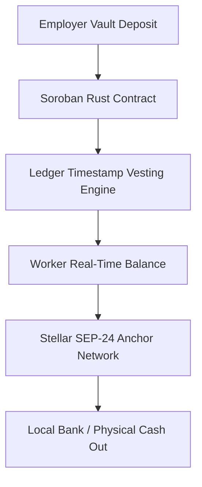

# PulsePay Overview

PulsePay is a zero-click, real-time payroll streaming and physical cash-out protocol built natively on **Soroban (Stellar Smart Contracts)**.

---

## 1. Executive Summary
Traditional global payroll processing relies on batch systems (ACH, SWIFT, domestic bank wires) that delay contractor and worker liquidity by 14 to 30 days. Intermediary banking fees consume 3% to 7% of total wages for cross-border transactions.

**PulsePay** eliminates batch processing by replacing traditional payroll cycles with continuous value transfer calculated per Soroban ledger timestamp. Workers gain real-time access to accrued wages second-by-second and can cash out directly to physical fiat currency using Stellar SEP-24 anchor networks.

---

## 2. Core Protocol Primitives

| Primitive | Technical Description | Benefit |
| :--- | :--- | :--- |
| **Soroban Vault** | Non-custodial Rust smart contract locking USDC payload | Eliminates employer default risk & manual payout overhead |
| **Timestamp Math** | Deterministic vesting per Stellar ledger timestamp (`env.ledger().timestamp()`) | Continuous, second-by-second wage accrual |
| **SEP-24 Off-Ramps** | Native integration with Stellar Hosted Deposit & Withdrawal anchors | Instant conversion from on-chain USDC to local physical fiat |
| **WebAuthn Auth** | Passkey/Biometric authentication via Soroban native primitives | Zero seed phrase management for enterprise workers |

---

## 3. Architecture Stack

- **Contracts:** Soroban Rust contract (`pulsepay-core`) managing non-custodial streams and clawbacks.
- **Backend Indexer:** Node.js service tracking ledger event topics (`stream_created`, `withdraw`, `cancel`).
- **Frontend App:** Next.js 15 application with high-contrast UI and biometric Passkey authentication.
- **Anchor Off-Ramp:** Integration with Stellar SEP-24 interactive anchors (`testanchor.stellar.org`).
